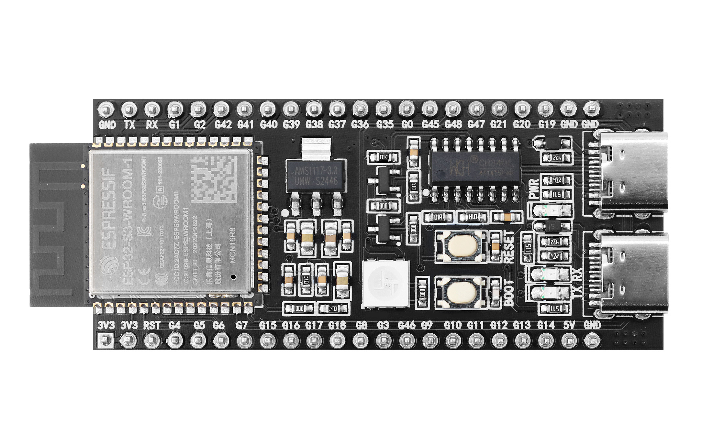
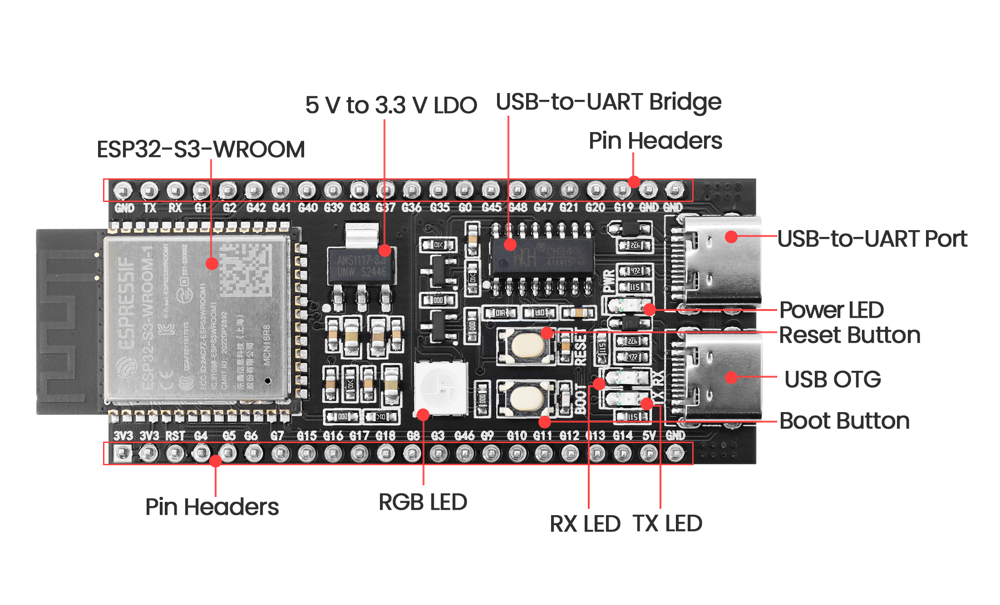

# ESP32-S3-DevKitC-1 Development Board

## Overview

The **ESP32-S3-DevKitC-1** is a powerful development board based on Espressif's **ESP32-S3** series chip. This board integrates Wi-Fi and Bluetooth® LE modules, providing great flexibility and support for Internet of Things (IoT) and Artificial Intelligence on Things (AIoT) applications. Its rich GPIO interfaces and strong processing capabilities allow developers to easily connect various external hardware and create complex embedded systems.

## Key Features

- **Processor**:
  - Built on a dual-core **Xtensa® LX7** processor with a maximum clock speed of **240 MHz**.
  - Supports accelerated machine learning inference, suitable for AI applications like speech recognition and image processing.

- **Wireless Connectivity**:
  - Supports **802.11 b/g/n Wi-Fi** (limited to 2.4 GHz).
  - Supports Bluetooth 5.0 and Bluetooth Low Energy (BLE).

- **Memory**:
  - 512 KB of SRAM; supports external **SPI Flash** and **PSRAM** expansion.

- **GPIO Interfaces**:
  - Provides up to **38 GPIO pins**, including:
    - Supports **ADC** (12-bit resolution), **DAC**, **PWM**, **I2C**, **SPI**, and **UART** communication protocols.

- **Security Features**:
  - Hardware encryption support (AES, SHA, RSA, etc.).
  - Supports **Secure Boot** and **Flash Encryption** for enhanced security.

- **Peripherals**:
  - Integrated multiple hardware accelerators to improve performance through signal processing.
  - Built-in **LED indicators** and buttons (such as Boot and Reset buttons) for easy development and debugging.

## Hardware Description

- **Power Management**:
  - Input voltage range: **3.0V to 5V**.
  - Low power consumption of **10 μA** in sleep mode, with optimized power usage during Wi-Fi operation, making it suitable for portable battery-powered devices.

- **Physical Dimensions**:
  - Dimensions are approximately **70mm x 28mm**, making it easy to embed in various projects.

- **Connection Interfaces**:
  - Powered through a **type C USB** interface for data transfer (programming and debugging).
  - Includes various standard interfaces for easy connection to peripherals.

## Development Ecosystem

The ESP32-S3-DevKitC-1 is compatible with multiple development platforms, allowing developers to use the following environments:

- **Arduino IDE**: Provides a simple interface, ideal for beginners looking for quick development.
- **ESP-IDF** (Espressif IoT Development Framework): Suitable for advanced developers working on custom projects.
- **PlatformIO**: Supports various integrated development environments, aiding modern development workflows.

## Application Areas

The ESP32-S3-DevKitC-1 is widely applicable, including but not limited to:

- **Smart Home**: Products like smart switches, lighting control, and environmental sensors.
- **Health Monitoring**: Wearable devices and health trackers for real-time data collection and analysis.
- **Industrial Automation**: Used for data collection, remote monitoring, and equipment control to improve productivity.
- **Edge Computing**: Processes and analyzes data within IoT networks to reduce latency and bandwidth consumption.

## Conclusion

The ESP32-S3-DevKitC-1 development board is an ideal choice for IoT and AI project development, featuring powerful capabilities, a variety of interfaces, and a flexible development ecosystem. Whether you are a beginner or an experienced developer, this board allows you to bring your creative projects to life. Its wide range of application fields makes it an essential tool in modern embedded system design.